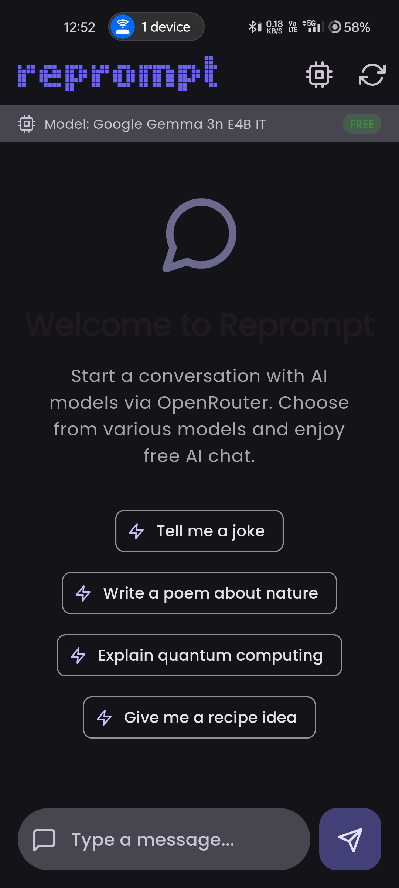
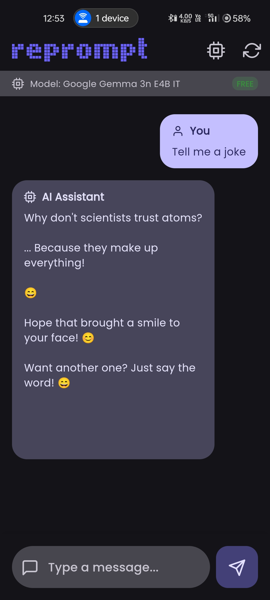
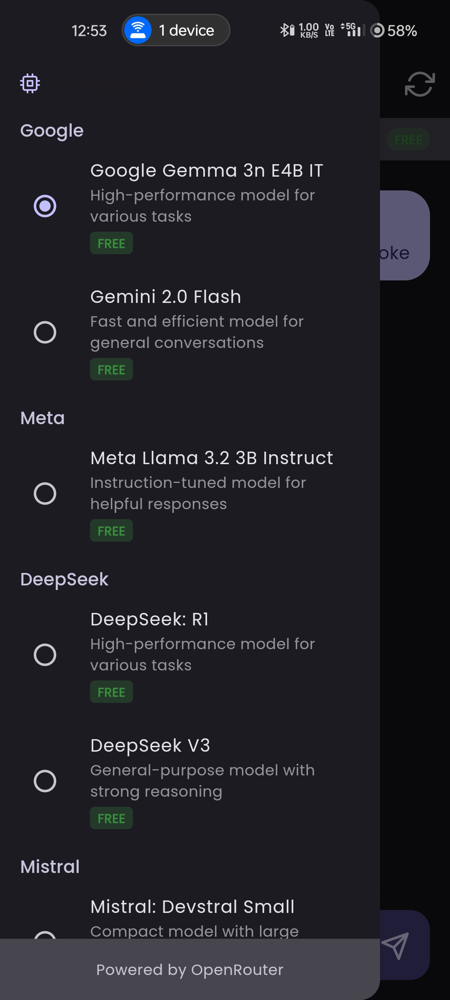

    
    <h1>reprompt</h1>
    
AI Chat assistant chatbot app

---

  
  
  

## Features
- AI chat assistant and text answers chatbot
- Supports 8+ AI Models including known models like gemini, llama, deepseek, and others
- Free to use

## Installation

## Tech Stack

**Client:** Flutter, Android, Web

**APIs:** Gemini 2.0 Flash, Gemma 3, Llama 3.2, Deepseek V3, R1, Mistral 4b, Qwen 30b, +more
